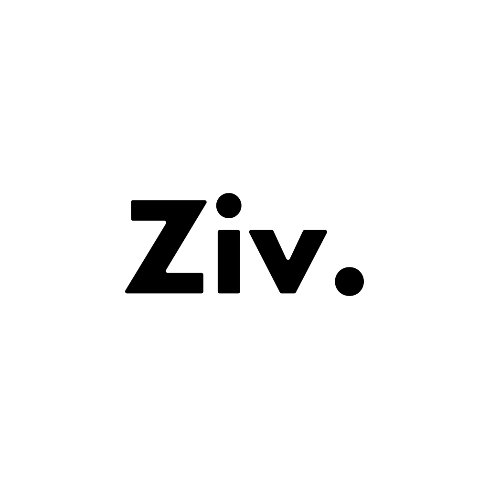
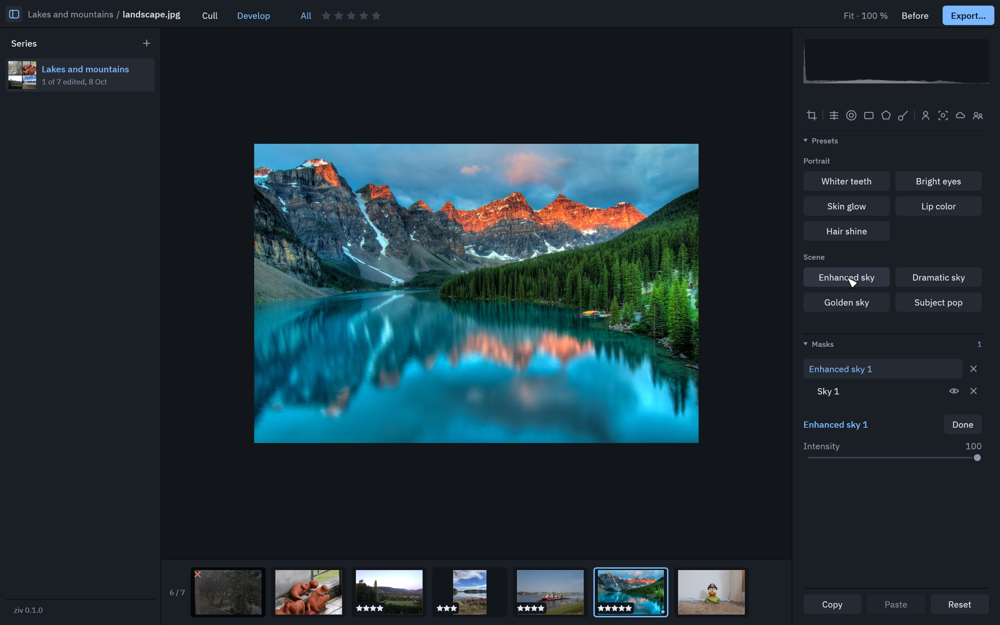
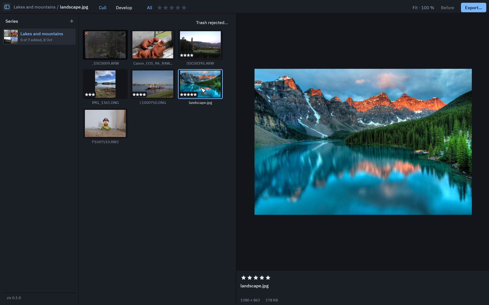

<p align="center">
  
</p>

<h1 align="center">ziv</h1>

<p align="center">
  <b>A light, free photo editor for Mac.</b><br>
  Sort your shots, develop your RAW files, retouch in one click, export.
</p>

<p align="center">
  <a href="#install">Install</a> ·
  <a href="#what-you-can-do">Features</a> ·
  <a href="#questions">Questions</a>
</p>

<p align="center">
  
</p>

ziv is for photographers who want the essentials of Lightroom without the
subscription or the learning curve. Open a folder of photos, keep the good
ones, make them look their best, export.

- **Free**, no account, no subscription.
- **Your originals are never modified.** Every edit can be undone, today or in a year.
- **Your photos stay on your Mac.** Nothing is uploaded.

## Install

**You need:** a Mac with an Apple chip (M1 or newer) and macOS 11 or later.

1. Open the **Terminal** app: press `⌘ Space`, type `Terminal`, press `Return`.
2. Copy this line, paste it into the Terminal window, press `Return`:

   ```sh
   curl -fsSL https://raw.githubusercontent.com/davidbonan/ziv/main/install.sh | sh
   ```

3. ziv opens by itself a few seconds later. From now on you find it in your
   **Applications** folder, like any other app.

That's all. You can close the Terminal.

<details>
<summary>Prefer not to use the Terminal?</summary>

<br>

1. Download `ziv-macos.zip` from the [latest release](https://github.com/davidbonan/ziv/releases/latest).
2. Double-click the zip, then drag **ziv** into your **Applications** folder.
3. Open ziv. macOS refuses the first time: open **System Settings › Privacy &
   Security**, scroll down and click **Open Anyway**.

The Terminal line above skips that last step.

</details>

### Updates

ziv tells you when a new version is out and installs it in one click. Nothing
to download again.

### Uninstall

Drag **ziv** from your Applications folder to the Trash.

## What you can do

### Sort your photos

- Open a folder or drop photos on the window: RAW, JPEG, PNG and TIFF.
- Browse a grid next to a large preview, rate from 1 to 5 stars, reject the misses.
- Show only your best shots, send the bad ones to the Trash.
- Each import is kept as a series: ziv reopens where you left off.

<p align="center">
  
</p>

### Develop

- Exposure, contrast, highlights, shadows, whites, blacks, white balance, vibrance, saturation.
- Tone curve, color mixer and color grading for a look of your own.
- Crop, straighten, rotate and mirror, with the usual aspect ratios.
- Histogram and shooting data always in view.
- Before / after with the `B` key, undo and redo, copy an edit from one photo to another.

### Retouch in one click

ziv finds the zone by itself and retouches it. One slider sets how strong.

| Portrait | Scene |
|----------|-------|
| Whiter teeth | Enhanced sky |
| Bright eyes | Dramatic sky |
| Skin glow | Golden sky |
| Lip color | Subject pop |
| Hair shine | |

### Retouch one part of the photo

- Select the **subject**, the **background**, the **sky**, or a person's
  **skin, hair, eyes, lips or clothes** automatically.
- Or draw the zone yourself: brush, linear and radial gradients, shapes.
- Each zone gets its own adjustments.

### Clean up noise

**Enhance** removes the grain of high-ISO photos and brings back detail. One
slider sets how much.

### Export

- JPEG (quality of your choice) or PNG.
- Full resolution or a size you choose, handy for the web.
- One photo or the whole series at once.

## Questions

**Does ziv change my original files?**
Never. Your edits are saved in a small file next to each photo
(`photo.ziv.json`). Delete it and the photo is back as shot.

**Does my camera work?**
Most RAW formats from Canon, Nikon, Sony, Fujifilm, Panasonic, Olympus and
others are read. Not sure? Open one of your files: if it shows, it works.

**Do I need internet?**
Only to install, to update, and the first time you use an automatic selection,
a one-click retouch or Enhance: ziv then downloads what it needs, once.

**Does it work on Windows, or on an older Intel Mac?**
Not for now.

**Something is wrong, or I have an idea.**
[Open an issue](https://github.com/davidbonan/ziv/issues), in plain words.

---

<details>
<summary>For developers</summary>

<br>

Written in Rust on `egui` and `wgpu`. Design and decisions: [`specs/`](specs/overview.md).

```sh
cargo run                # the app, without updates
./scripts/bundle.sh      # dist/ziv.app
cargo test
```

A `v<version>` tag matching `Cargo.toml` makes CI
([`release.yml`](.github/workflows/release.yml)) test, bundle and publish
`ziv-macos.zip`.

</details>

## Credits and license

- ziv's own source is under the [MIT](LICENSE) license.
- RAW decoding by [`rawler`](https://crates.io/crates/rawler), LGPL-2.1. The
  source of every release is this repository at its tag: ziv can be rebuilt
  with another version of `rawler`.
- Detection and enhancement models are not part of ziv: each is downloaded from
  its publisher the first time it is used. The two models that find skin, hair,
  clothes, eyes and lips (`Xenova/segformer_b2_clothes`, `Xenova/face-parsing`)
  are under non-commercial licenses. ziv is given away, never sold.
